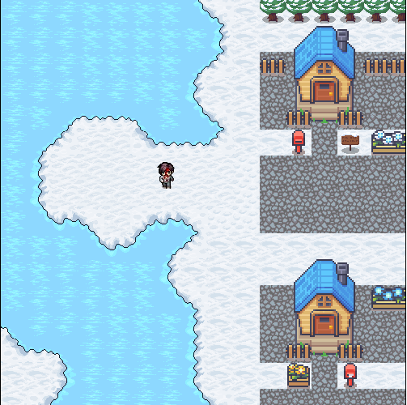

# JOGO_CANVAS-3D
## Status do projeto : FINALIZADO ✅

### Objetivo do projeto :
  Criar uma jogo  utilizando a tag canvas 3D do JavaScript.
 
### Desenvolvimento :
 Foi produzido um jogo pixelado do zero, criamos um mapa em pixel art e após isso fizemos toda fisica e movimentação de um personagem utilizando o recorte continuo de uma imagem.
 Adcionamos NPCs e um mapa com mais de um bioma para melhor dessenvolvimento da história, tudo utilizando javaScript.

### Sobre o projeto :
  Esse projeto, foi realizado em conjunto com mais três integrantes, foi proposto pelo Professor da UFRN, Taniro Rodrigues. 
  
